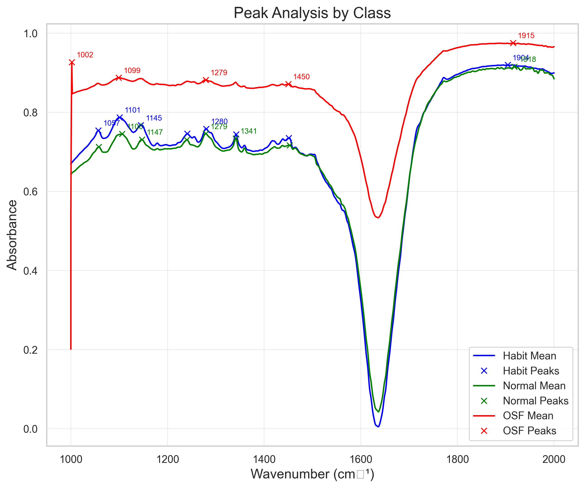
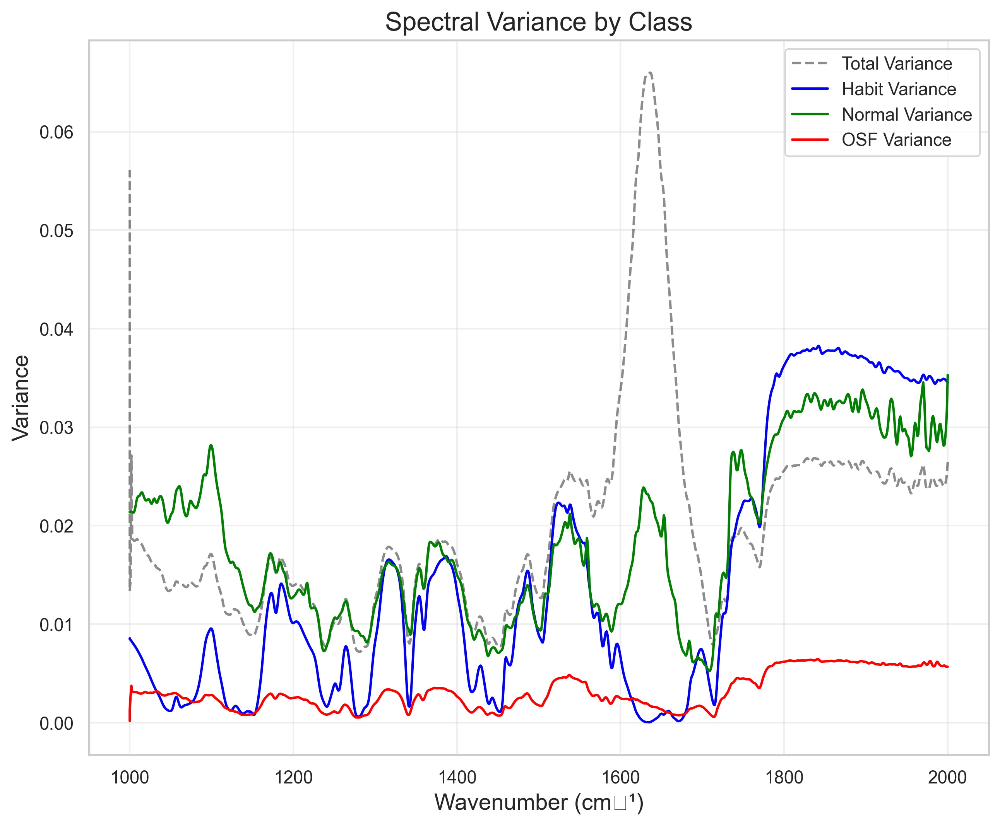

# FTIR Spectral Analysis Tool

An advanced tool for analyzing FTIR (Fourier Transform Infrared) spectral data using machine learning techniques. This tool provides comprehensive data preprocessing, feature extraction, model training, and visualization capabilities for spectral analysis.

## Sample Visualizations

<table>
<tr>
    <td width="50%">
        
        <p align="center"><em>Model Performance Comparison</em></p>
    </td>
    <td width="50%">
        
        <p align="center"><em>ROC Curves with Confidence Intervals</em></p>
    </td>
</tr>
<tr>
    <td width="50%">
        
        <p align="center"><em>Average FTIR Spectra by Class</em></p>
    </td>
    <td width="50%">
        
        <p align="center"><em>Peak Analysis and Feature Detection</em></p>
    </td>
</tr>
</table>

<p align="center">
    
    <br>
    <em>Spectral Variance Across Different Classes</em>
</p>

## Table of Contents
1. [Features](#features)
2. [Data Format](#data-format)
3. [Requirements](#requirements)
4. [Installation](#installation)
5. [Usage Guide](#usage-guide)
6. [Troubleshooting](#troubleshooting)

## Features

### Data Processing
- **Spectral Preprocessing**:
  - Baseline correction and normalization
  - Peak detection and analysis
  - Spectral derivatives (first and second order)
  - Outlier detection and handling
  - Automated data validation

### Machine Learning Models
- **Multiple Classifiers**:
  - Logistic Regression
  - Random Forest
  - Gradient Boosting
  - Support Vector Machines (SVM)
  - Neural Networks
- **Model Evaluation**:
  - Cross-validation
  - Performance metrics (accuracy, precision, recall, F1)
  - ROC curves with confidence intervals
  - Feature importance analysis

### Visualization
- **Comprehensive Plots**:
  - Average spectra by class
  - Peak analysis visualization
  - Spectral variance plots
  - Feature importance plots
  - ROC curves with confidence intervals
  - Model performance comparisons

## Data Format

### Required Files
Place your FTIR spectral data files in the `data/` directory:
1. `osmf.xlsx`: OSF group data (100 samples)
2. `habit.xlsx`: Habit group data (100 samples)
3. `normal.xlsx`: Normal group data (100 samples)

### File Structure
Each Excel file must follow this format:
```
Wave Number | Sample 1 | Sample 2 | ... | Sample N
2000        | 0.234   | 0.456    | ... | 0.789
1999        | 0.345   | 0.567    | ... | 0.890
...         | ...     | ...      | ... | ...
1000        | 0.123   | 0.345    | ... | 0.678
```

### Data Requirements
1. **Wave Numbers**:
   - Range: 2000-1000 cm⁻¹
   - Must be in descending order
   - Consistent across all files
2. **Samples**:
   - Approximately 100 samples per group
   - No missing values (NaN) or text entries
   - Numeric values only
3. **File Format**:
   - Excel files (.xlsx or .xls)
   - First column: Wave numbers
   - Subsequent columns: Individual sample spectra

## Requirements

- Python 3.8 or higher
- Dependencies listed in `requirements.txt`

## Installation

1. Clone this repository:
   ```bash
   git clone https://github.com/rupesh43210/FITR_spectral_Analysys.git
   cd FITR_spectral_Analysys
   ```

2. Run the setup script:
   ```bash
   chmod +x setup.sh
   ./setup.sh
   ```

   This will:
   - Create and configure a Python virtual environment
   - Install all required dependencies
   - Set up the project structure
   - Configure code quality tools

## Usage Guide

### 1. Data Preparation
- Ensure your data files follow the format specified in [Data Format](#data-format)
- Place files in the `data/` directory
- For testing, generate example data:
  ```bash
  python scripts/generate_example_data.py
  ```

### 2. Run Analysis
```bash
python src/process_ftir.py
```

### 3. View Results
The analysis will create:
- Model performance metrics
- Visualization plots
- Trained model files
- Detailed analysis report

Results are saved in: `output/analysis_<timestamp>/`

## Troubleshooting

### Common Issues

1. **Missing Dependencies**:
   ```bash
   pip install -r requirements.txt
   ```

2. **Data Format Errors**:
   - Ensure wave numbers are in descending order
   - Check for missing values or text entries
   - Verify consistent wave number ranges

3. **Memory Issues**:
   - Reduce batch size in model configuration
   - Use data subsampling if needed

4. **Model Convergence**:
   - Adjust learning rate
   - Increase max iterations
   - Try different model parameters

### Getting Help
For additional help or to report issues:
1. Check the documentation in `docs/`
2. Submit an issue on the repository
3. Contact the development team

## License
[Your License Information]

## Project Structure

```
FTIR_spectral_Analysis/
├── data/                   # Data directory for FTIR spectral files
│   ├── osmf.xlsx          # OSF group spectral data
│   ├── habit.xlsx         # Habit group spectral data
│   └── normal.xlsx        # Normal group spectral data
│
├── src/                   # Source code directory
│   ├── process_ftir.py    # Main script to run the analysis
│   ├── data_processor.py  # Data preprocessing and feature extraction
│   ├── model_trainer.py   # Machine learning model training and evaluation
│   └── visualizer.py      # Visualization and plotting functions
│
├── output/               # Output directory for results
│   └── analysis_*/       # Timestamped analysis results
│       ├── models/       # Saved trained models
│       ├── plots/        # Generated visualizations
│       └── reports/      # Analysis reports and logs
│
├── images/              # Documentation images and plots
│   ├── model_comparison.png
│   ├── roc_curves.png
│   ├── average_spectra.png
│   ├── peak_analysis.png
│   └── spectral_variance.png
│
├── tests/              # Test directory
│   └── ...            # Test files for each module
│
├── docs/              # Documentation directory
│   └── ...           # Additional documentation files
│
├── setup.sh          # Setup script for environment configuration
├── requirements.txt  # Python package dependencies
├── .gitignore       # Git ignore file
├── LICENSE          # License file
└── README.md        # Project documentation
```

### Key Components

1. **Source Code (`src/`)**:
   - `process_ftir.py`: Main entry point for running the analysis
   - `data_processor.py`: Handles data loading, preprocessing, and feature extraction
   - `model_trainer.py`: Implements machine learning model training and evaluation
   - `visualizer.py`: Creates visualizations and plots for analysis results

2. **Data Directory (`data/`)**:
   - Contains FTIR spectral data files in Excel format
   - Each file represents a different group (OSF, Habit, Normal)
   - Follows standardized format (wave numbers vs. spectra)

3. **Output Directory (`output/`)**:
   - Contains timestamped directories for each analysis run
   - Stores trained models, visualizations, and analysis reports
   - Preserves complete history of analysis results

4. **Documentation Images (`images/`)**:
   - Contains visualization examples used in documentation
   - Demonstrates key features and capabilities
   - Provides visual reference for analysis outputs

5. **Configuration Files**:
   - `setup.sh`: Automates environment setup and dependency installation
   - `requirements.txt`: Lists all Python package dependencies
   - `.gitignore`: Specifies files to ignore in version control

## Contributing

1. Fork the repository
2. Create a feature branch
3. Make your changes
4. Run tests: `pytest tests/`
5. Submit a pull request
